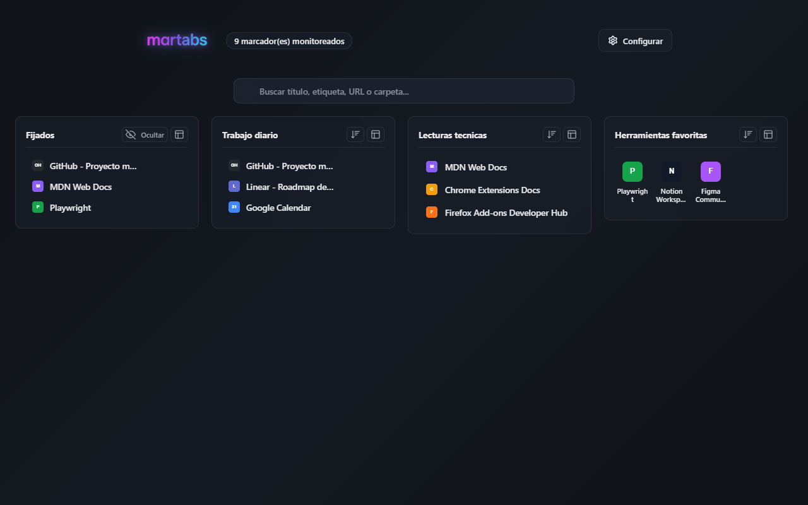
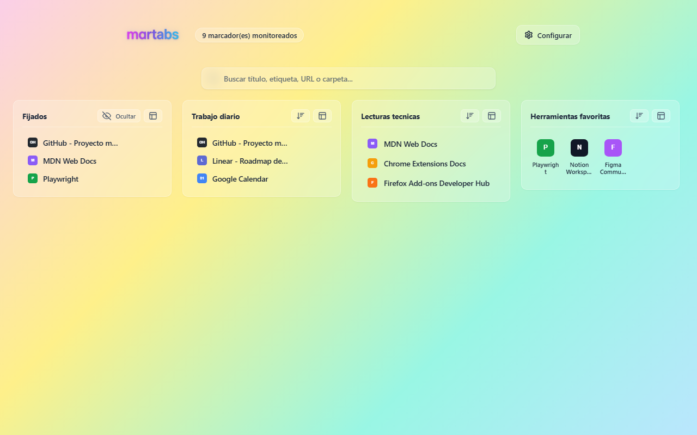
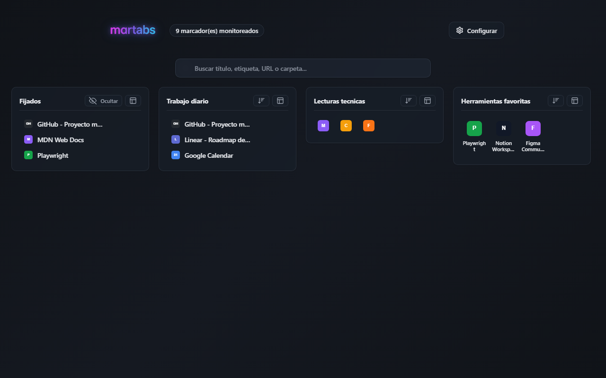
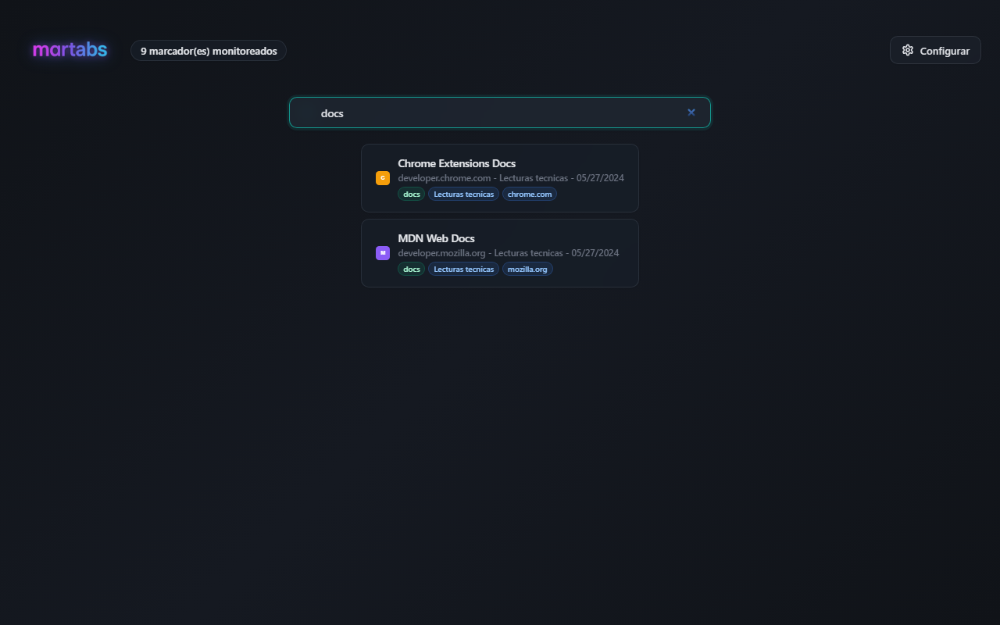
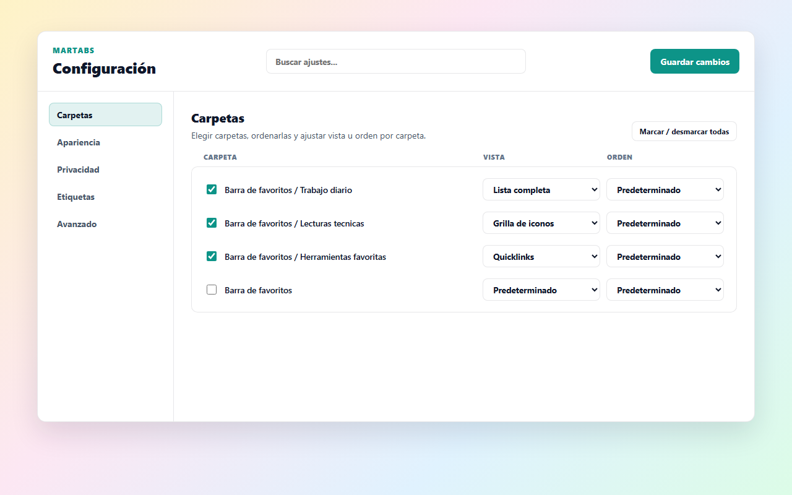
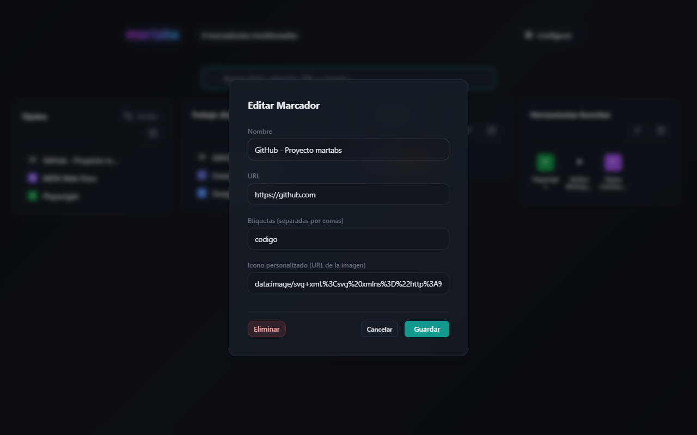

*Read this in other languages: [English](README.md).*

# martabs

Una extension de navegador que reemplaza la pagina de Nueva pestana por un tablero local de marcadores.

El objetivo es encontrar rapido marcadores guardados en carpetas grandes, con busqueda, etiquetas, vistas visuales, orden local y herramientas de limpieza, sin depender de servicios externos.

Compatible con Chrome, Edge, Brave y Firefox.

## Capturas



| Dashboard (Claro) | Modos visuales |
| --- | --- |
|  |  |

| Búsqueda | Configuración |
| --- | --- |
|  |  |

| Edición de marcador |
| --- |
|  |

## Funciones

- Nueva pestana con dashboard tipo masonry.
- Seleccion de carpetas monitoreadas.
- Busqueda instantanea por titulo, URL, dominio, carpeta y etiquetas.
- Etiquetas automaticas y manuales.
- Favoritos fijados dentro de su carpeta y en una carpeta virtual superior.
- Modos visuales por carpeta: lista, compacta, iconos, iconos grandes y quicklinks.
- Orden visual global y por carpeta: original, manual, titulo, fecha, dominio o fallidos primero.
- Drag & drop local para reordenar marcadores y moverlos entre carpetas.
- Edicion desde la UI: titulo, URL, etiquetas manuales, icono custom y eliminacion.
- Fallback automatico para iconos custom rotos.
- Vista rapida opcional al pasar el mouse.
- Capturas locales opcionales al abrir marcadores desde martabs.
- Revision manual de enlaces caidos por carpeta.
- Tema claro, oscuro o automatico segun el sistema.
- Selector de idioma con 9 idiomas disponibles: espanol, ingles, portugues, aleman, frances, italiano, coreano, chino simplificado y japones.
- Exportar e importar configuracion con remapeo de IDs entre perfiles.
- Configuracion organizada por secciones con buscador de ajustes.

## Privacidad

martabs guarda todo localmente en el navegador. No usa servicios externos para previews, iconos, busqueda, metadata ni sincronizacion. No hay telemetria ni recoleccion de datos.

Las capturas de pantalla solo se generan si el usuario activa la opcion y abre un marcador desde martabs. La revision de enlaces solo se ejecuta por accion explicita del usuario.

Permisos base:

- `bookmarks`: leer y editar marcadores cuando el usuario lo pide.
- `storage`: guardar configuracion local, etiquetas, ordenes, previews y estados.
- `favicon` (solo Chrome): leer favicons locales del navegador.

Permisos opcionales:

- Acceso a URLs para revisar enlaces caidos.
- Acceso a URLs para capturar previews locales.

Al desactivar estas opciones desde Configuracion, martabs intenta retirar los permisos opcionales.

Politica de privacidad publica: https://unksgit.github.io/martabs/privacy_policy.html

## Instalacion en modo desarrollador

Requisitos:

- Node.js (18 o superior recomendado).

```bash
npm install
npm run build
```

### Chrome, Edge o Brave

1. Abrir `chrome://extensions` (o `brave://extensions` / `edge://extensions`).
2. Activar modo desarrollador.
3. Cargar la carpeta `dist/chrome` como extension descomprimida.

### Firefox

1. Abrir `about:debugging#/runtime/this-firefox`.
2. Elegir `Cargar complemento temporal`.
3. Seleccionar `dist/firefox/manifest.json`.

## Desarrollo

Comandos principales:

```bash
npm test            # tests unitarios con node --test
npm run build       # genera dist/chrome y dist/firefox
npm run build:chrome
npm run build:firefox
npm run package     # genera zips finales en release/
```

Tests E2E (requiere Playwright instalado):

```bash
npm run test:e2e:chrome    # E2E solo en Chromium
```

Los tests E2E en Firefox tienen limitaciones documentadas en `docs/firefox-testing-issues.md`.

## Estructura del proyecto

```
src/
  _locales/           traducciones (es, en, pt, de, fr, it, ko, zh_CN, ja)
  background/         service worker (reindexado, capturas)
  newtab/             tablero de Nueva pestana
  setup/              panel de Configuracion
  shared/             helpers compartidos (i18n, busqueda, orden, render, storage, sync)
  manifest.base.json  manifest comun
  manifest.chrome.json
  manifest.firefox.json
tests/                tests unitarios
e2e/                  tests E2E con Playwright
scripts/              build script
docs/                 documentacion viva
```

## Documentacion

- `docs/task.md` - estado actual del proyecto y registro de cambios.
- `docs/implementation_plan.md` - arquitectura vigente.
- `docs/maintenance_notes.md` - reglas para flujos sensibles.
- `docs/testing.md` - verificacion recomendada.
- `docs/walkthrough.md` - funcionalidades desde la perspectiva del usuario.
- `docs/collaboration.md` - como colaborar entre herramientas.
- `docs/roadmap.md` - pendientes y planes futuros.
- `docs/firefox-testing-issues.md` - limitaciones de E2E en Firefox.

## Colaboracion con IA

Este proyecto fue desarrollado de forma colaborativa entre el autor y asistentes de IA:

- **Antigravity** (Google DeepMind) con modelos Gemini.
- **Codex** (OpenAI) con modelos GPT.

La documentacion en `docs/collaboration.md` describe como trabajar con agentes de IA propios sin depender de una herramienta especifica. Los cambios se registran en `docs/task.md` indicando la herramienta utilizada.

## Licencia

martabs se publica bajo GPL-3.0-only. Ver `LICENSE`.
