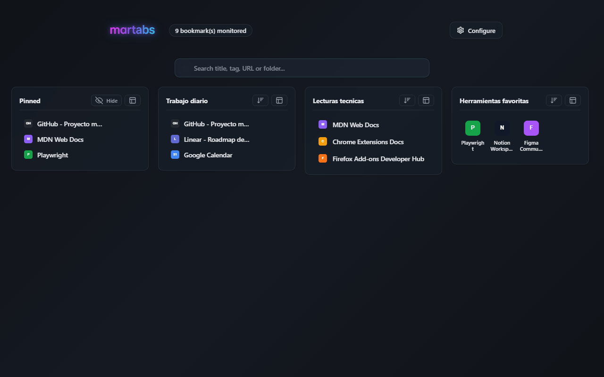
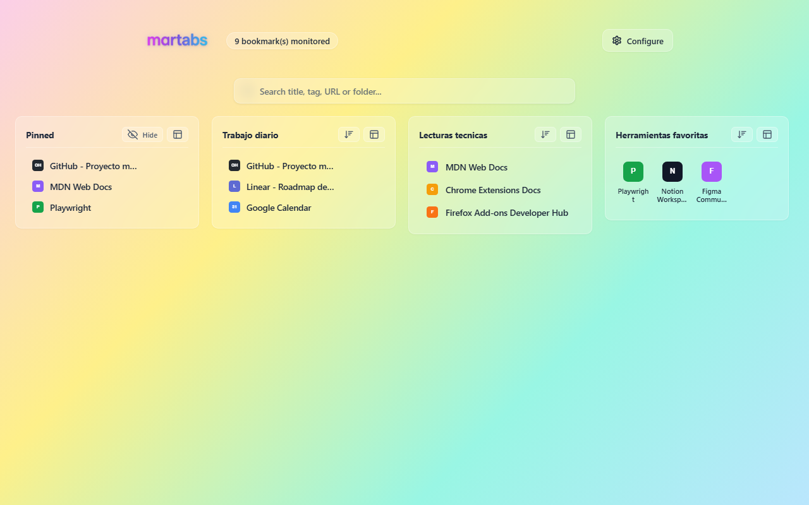
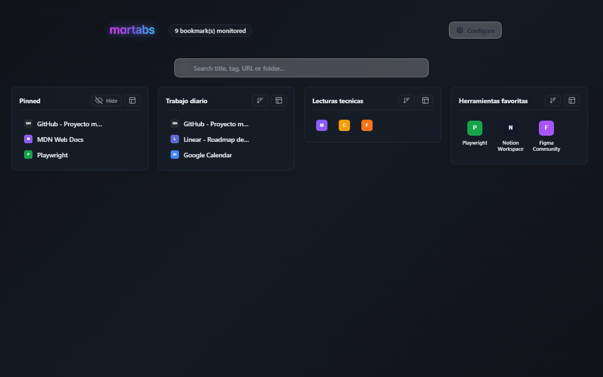
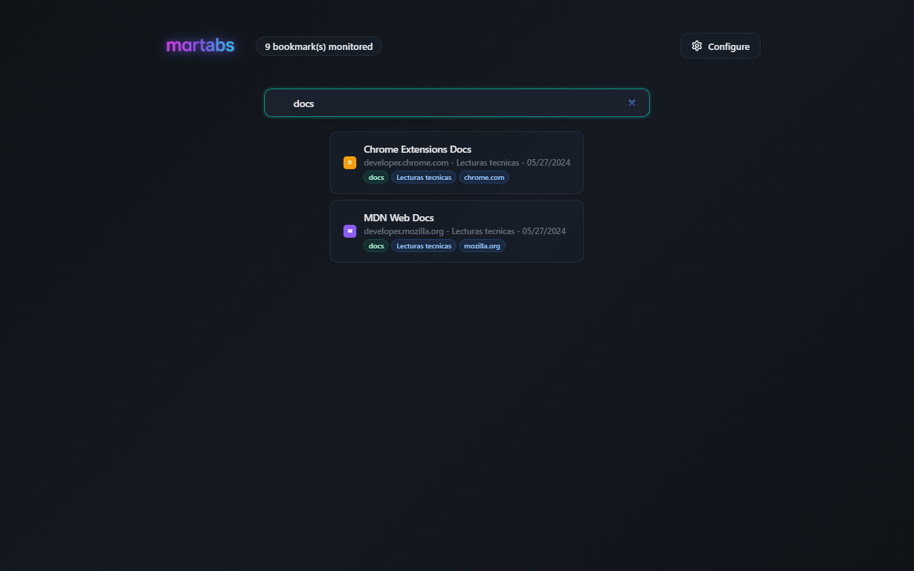
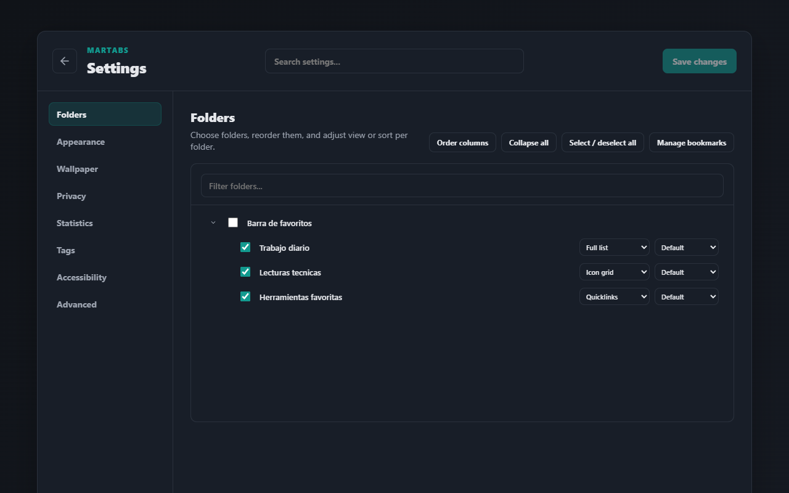
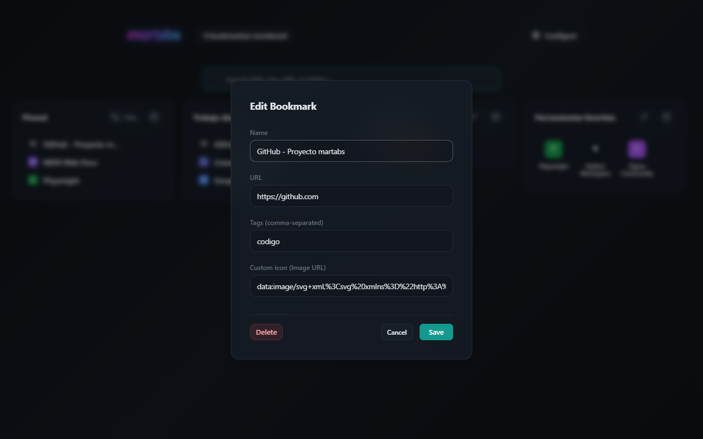

*Read this in other languages: [Español](README.es.md).*

# martabs

A browser extension that replaces the New Tab page with a local, private bookmark dashboard.

The goal is to easily find bookmarks saved in large folders, featuring instant search, tags, visual modes, local ordering, and link health tools—without relying on external services.

Compatible with Chrome, Edge, Brave, and Firefox.

## Screenshots



| Dashboard (Light) | Visual Modes |
| --- | --- |
|  |  |

| Search | Settings |
| --- | --- |
|  |  |

| Edit Bookmark |
| --- |
|  |

## Features

- New Tab with masonry-style dashboard layout.
- Monitored folder selection.
- Instant search by title, URL, domain, folder, and tags.
- Automatic and manual tags.
- Pinned favorites within their folder and in a virtual top-level folder.
- Visual modes per folder: list, compact, icons, large icons, and quicklinks.
- Visual ordering globally and per folder: original, manual, title, date, domain, or broken-first.
- Local drag & drop to reorder bookmarks and move them between folders.
- In-UI editing: title, URL, manual tags, custom icon, and deletion.
- Automatic fallback for broken custom icons.
- Optional quick-view tooltips on hover.
- Optional local screenshots triggered when opening bookmarks from martabs.
- Manual link-health checking per folder.
- Theme: light, dark, or system default.
- Language selector with 9 supported languages: English, Spanish, Portuguese, German, French, Italian, Korean, Simplified Chinese, and Japanese.
- Settings export and import with profile ID remapping.
- Settings panel with built-in search.

## Privacy

martabs stores everything locally in the browser. It does not use external services for previews, icons, search, metadata, or synchronization. There is no telemetry or data collection of any kind.

Screenshots are only generated if you actively enable the option and open a bookmark from martabs. Link checking is only triggered by your explicit action.

Base permissions:

- `bookmarks`: to read the bookmark tree and save user edits.
- `storage`: to save local settings, tags, orders, previews, and state.
- `favicon` (Chrome only): to read native browser favicons.

Optional permissions:

- Host permissions: requested dynamically only if you enable link health checks or local previews.

When you disable these options from the Settings panel, martabs attempts to revoke the optional permissions.

Public Privacy Policy: https://unksgit.github.io/martabs/privacy_policy.html

## Installation (Developer Mode)

Requirements:

- Node.js (18 or higher recommended).

```bash
npm install
npm run build
```

### Chrome, Edge, or Brave

1. Open `chrome://extensions` (or `brave://extensions` / `edge://extensions`).
2. Enable Developer mode.
3. Load the `dist/chrome` folder as an unpacked extension.

### Firefox

1. Open `about:debugging#/runtime/this-firefox`.
2. Click `Load Temporary Add-on`.
3. Select `dist/firefox/manifest.json`.

## Development

Main commands:

```bash
npm test            # unit tests using node --test
npm run build       # generates dist/chrome and dist/firefox
npm run build:chrome
npm run build:firefox
npm run package     # generates final zips in release/
```

E2E Tests (requires Playwright installed):

```bash
npm run test:e2e:chrome    # E2E on Chromium only
```

E2E testing in Firefox has documented limitations. See `docs/firefox-testing-issues.md`.

## Project Structure

```
src/
  _locales/           translations (en, es, pt, de, fr, it, ko, zh_CN, ja)
  background/         service worker (re-indexing, local captures)
  newtab/             New Tab dashboard
  setup/              Settings panel
  shared/             shared helpers (i18n, search, sort, render, storage, sync)
  manifest.base.json  common manifest
  manifest.chrome.json
  manifest.firefox.json
tests/                unit tests
e2e/                  E2E tests using Playwright
scripts/              build scripts
docs/                 living documentation
```

## Documentation

- `docs/task.md` - current project status and changelog.
- `docs/implementation_plan.md` - current architecture.
- `docs/maintenance_notes.md` - rules for sensitive flows.
- `docs/testing.md` - recommended verification steps.
- `docs/walkthrough.md` - user-perspective features.
- `docs/collaboration.md` - how to collaborate across AI tools.
- `docs/roadmap.md` - pending items and future plans.
- `docs/firefox-testing-issues.md` - E2E limitations in Firefox.

## AI Collaboration

This project was developed collaboratively between the author and AI assistants:

- **Antigravity** (Google DeepMind) using Gemini models.
- **Codex** (OpenAI) using GPT models.

The documentation in `docs/collaboration.md` describes how to work with your own AI agents without depending on a specific tool. Changes are logged in `docs/task.md`, indicating the tool used.

## License

martabs is published under the GPL-3.0-only license. See `LICENSE`.
