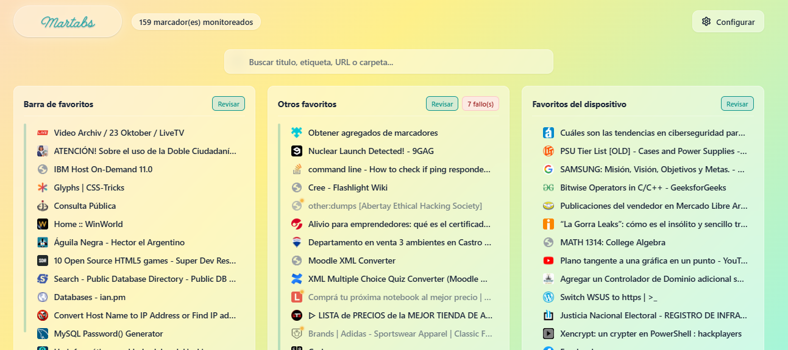
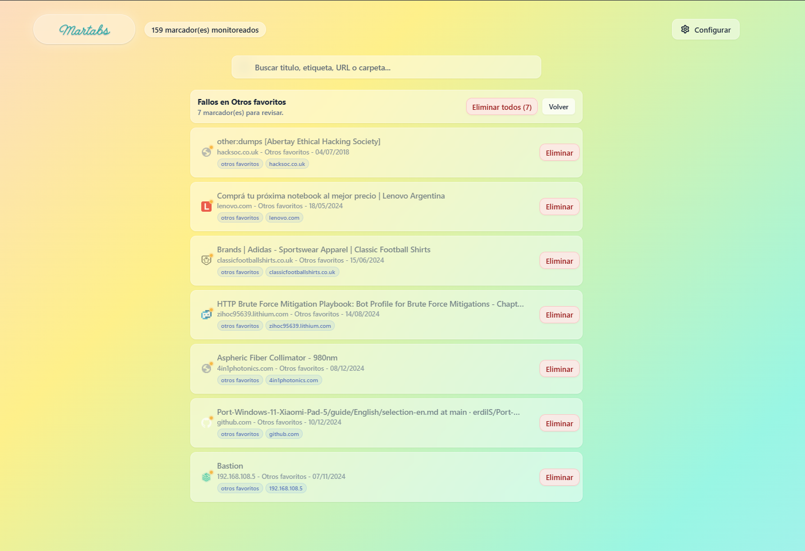
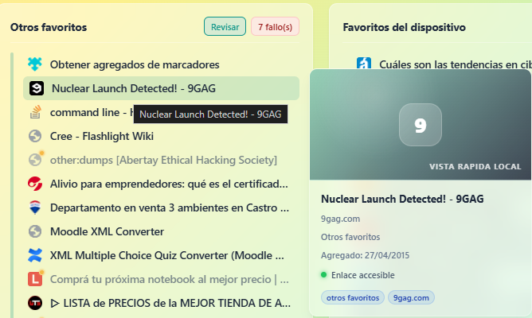
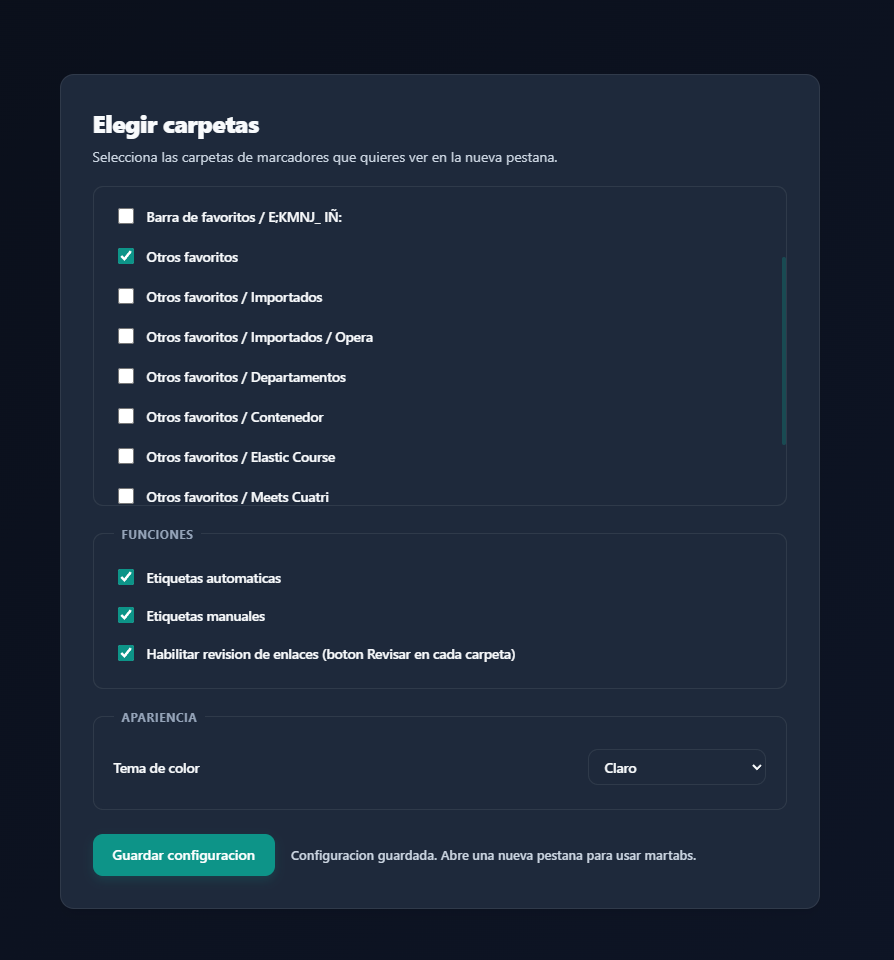

<div align="center">
  
  <h1>martabs</h1>
  <p><strong>Un dashboard visual, rápido y privado para tus carpetas de marcadores.</strong></p>
</div>

---

**martabs** es una extensión de navegador ligera que reemplaza tu aburrida página de *Nueva Pestaña* por un dashboard elegante e interactivo. Diseñada con un enfoque en la velocidad y la privacidad, mantiene todo localmente en tu navegador sin enviar tus datos a terceros.

<div align="center">
  
  <p><em>Vista principal del dashboard (Tema Oscuro)</em></p>
</div>

## ✨ Características Principales

- **📂 Gestión por Carpetas:** Elige exactamente qué carpetas de marcadores quieres monitorear y visualizar en tu nueva pestaña.
- **🎨 Diseño Premium:** Interfaz moderna tipo "glassmorphism", animaciones fluidas y soporte completo para **Modo Claro** y **Modo Oscuro** automático.
- **🔍 Búsqueda Instantánea:** Encuentra lo que necesitas al instante buscando por título, URL, dominio, carpeta o etiquetas.
- **🏷️ Etiquetado Inteligente:** Generación automática de etiquetas basadas en la carpeta y el dominio, más soporte para etiquetas manuales.
- **🩺 Monitoreo de Enlaces (Opcional):** Revisa el estado de tus marcadores con un solo clic. martabs comprobará si los enlaces están caídos y te permitirá limpiar tu colección fácilmente.
- **🛡️ 100% Privado:** Todo el procesamiento y almacenamiento se realiza localmente. Sin servidores externos, sin rastreadores.

## 📸 Galería

<div align="center">
  
  
  <p><em>Herramienta de revisión de enlaces caídos y tarjeta de vista rápida al pasar el cursor.</em></p>
</div>

## 🚀 Instalación (Modo Desarrollador)

Actualmente, **martabs** debe instalarse manualmente. Soporta **Google Chrome**, **Brave**, **Edge** y **Mozilla Firefox**.

### Prerrequisitos
Necesitas tener instalado [Node.js](https://nodejs.org/) para compilar la extensión.

1. Clona este repositorio o descarga el `.zip`.
2. Instala las dependencias:
   ```bash
   npm install
   ```
3. Compila la extensión:
   ```bash
   npm run build
   ```

### En Chrome / Brave / Edge
1. Ve a `chrome://extensions` (o `brave://extensions`, `edge://extensions`).
2. Activa el **Modo desarrollador** (arriba a la derecha).
3. Haz clic en **Cargar descomprimida** y selecciona la carpeta `dist/chrome` que se generó dentro del proyecto.

### En Firefox
1. Ve a `about:debugging#/runtime/this-firefox`.
2. Haz clic en **Cargar complemento temporal**.
3. Selecciona el archivo `manifest.json` dentro de la carpeta `dist/firefox`.

## ⚙️ Configuración

Al instalarla por primera vez, verás un mensaje para configurar tus carpetas. Haz clic en **Configurar** (arriba a la derecha) y elige las carpetas que quieres que martabs indexe. Desde ahí también podrás habilitar la **Revisión de enlaces caídos** y cambiar el **Tema de color**.

<div align="center">
  
</div>

## 🛠️ Arquitectura Técnica

- **Manifest V3:** Construido bajo los últimos estándares de extensiones web.
- **Vanilla JS & CSS:** Sin frameworks pesados. Rendimiento nativo.
- **Service Worker Reactivo:** Solo se despierta para reconstruir el índice de marcadores en segundo plano cuando detecta cambios.

## 📝 Licencia

Este proyecto es de código abierto. Siéntete libre de modificarlo y adaptarlo a tus necesidades.
