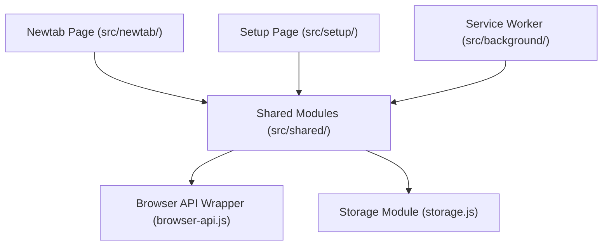

# AI Codebase Map - martabs

This high-level architectural map helps AI agents (Gemini/Antigravity, Codex, Claude) navigate the `martabs` Chrome/Firefox extension codebase efficiently. It highlights main components, responsibilities, crucial constraints, and cross-component impacts.

---

## Global Rule

> [!IMPORTANT]
> **Verification First:** This map provides high-level orientation and documents implicit architectural knowledge. However, agents must always validate codebase state using exact grep (`rg`) and reading the actual source files before proposing or editing code. Do not treat this map as an absolute source of truth if it conflicts with the source code.

---

## Codebase Architecture Overview

`martabs` is a Manifest V3 WebExtension that serves as a custom new tab page for bookmark organization. The codebase consists of standard HTML/CSS/JS frontend views, a background service worker, and shared modules. No transpilers or complex build pipelines are used; the extension runs native JS modules directly.



---

## Component Index

### 1. Newtab Dashboard (`newtab`)
*   **Key Files:**
    *   [newtab.html](../src/newtab/newtab.html)
    *   [newtab.css](../src/newtab/newtab.css)
    *   [newtab.js](../src/newtab/newtab.js)
*   **Responsibilities:**
    *   Renders user's selected bookmark folders using a CSS columns masonry layout.
    *   Handles interactive features: search, pinned bookmarks, custom local folder names (aliases), manual sorting, link health display, custom/fallback favicons, and light/dark theme switching.
*   **Related Tests:**
    *   [newtab.test.js](../tests/newtab.test.js) (controller imports, layout checks, and topSites/preview boundaries)
    *   E2E tests under `e2e/tests/` (Playwright E2E suites)
*   **Rules of Care (Crucial Constraints):**
    *   **Early Theme Injection:** To prevent a flash of light mode (FOUC), an inline `<script>` must exist in the `<head>` of `newtab.html`. It reads `chrome.storage.local` asynchronously and applies `.theme-dark` / `.theme-light` before modules load.
    *   **Obsolete Styles:** Obsolete CSS variables (`--card-bg`, `--border-color`, `--text-color`, `--accent-color`, `--hover-color`) are strictly forbidden (enforced by static analysis in tests).
    *   **Chromium Backdrop Bug:** Chrome does not handle `backdrop-filter` correctly with overlapping semitransparent layers. Floating elements (e.g. preview card, custom modals) must use solid background colors.

---

### 2. Configuration & Settings (`setup`)
*   **Key Files:**
    *   [setup.html](../src/setup/setup.html)
    *   [setup.css](../src/setup/setup.css)
    *   [setup.js](../src/setup/setup.js)
*   **Responsibilities:**
    *   Settings panels: Folders selection, Appearance (modes, languages, themes), Privacy, Tags, and Advanced tools.
    *   Handles configuration export/import, resetting hidden TopSites, statistics and local state, clearing preview caches.
*   **Related Tests:**
    *   [setup.test.js](../tests/setup.test.js) (loads correct sections, avoids obsolete variables, form serialization, permission dependencies)
*   **Rules of Care (Crucial Constraints):**
    *   **Settings Preservation:** Never reconstruct settings objects from scratch when saving. Always fetch the existing state and merge form updates onto `currentSettings` to avoid discarding internal settings flags (e.g. `bookmarkFolderOverrides`, `folderBookmarkOrders`, `folderNameOverrides`).
    *   **Unified Early Theme Script:** The early inline theme-sync script in `setup.html` must remain identical to `newtab.html`'s head script.

---

### 3. Background Service Worker (`background`)
*   **Key Files:**
    *   [service-worker.js](../src/background/service-worker.js)
*   **Responsibilities:**
    *   Handles local preview capture: listens to `CAPTURE_OPENED_BOOKMARK` message from the frontend, arms a short timeout, validates active tab matching target URL, captures visible tab via `chrome.tabs.captureVisibleTab`, and saves data URI.
*   **Related Tests:**
    *   [service-worker.test.js](../tests/service-worker.test.js) (mocks `chrome` context, verifies message handlers, validation logic, capture abort conditions)
*   **Rules of Care (Crucial Constraints):**
    *   **Silent Failures:** Screenshot capture is highly fragile (unsupported on system URLs, PDFs, local files). Failure to capture must fail silently; never log exceptions to the console or raise alerts.
    *   **Visual Settings Safe Guard:** Do not trigger index rebuild actions on visual settings adjustments (e.g., changes to theme, language, etc.).

---

### 4. Storage & Synchronization (`shared/storage` & `shared/sync`)
*   **Key Files:**
    *   [storage.js](../src/shared/storage.js)
    *   [sync.js](../src/shared/sync.js)
*   **Responsibilities:**
    *   `storage.js`: Central source of truth for `DEFAULT_SETTINGS` schema, storage keys, getter/setter helpers.
    *   `sync.js`: Serializes/deserializes backup configurations. Remaps bookmark IDs during profile migrations by matching folders tree paths instead of raw IDs.
*   **Related Tests:**
    *   [sync.test.js](../tests/sync.test.js) (verifies export mapping, ID remapping, schemas allowlist filter)
*   **Rules of Care (Crucial Constraints):**
    *   **No Auto-normalization:** A `normalizeSettings` function is **not** implemented in `storage.js`. Do not assume settings schema self-corrects or normalizes automatically on load/save.
    *   **Import Allowlist:** When importing, filter preferences against `booleanSettings` and `stringSettings` allowlists to prevent importing malicious or corrupt properties.
    *   **Permissions Validation:** If imported settings enable `linkHealthEnabled` or `previewCaptureEnabled`, verify actual runtime permissions first. Fallback to `false` if permission is missing.

---

### 5. Internationalization (`shared/i18n`)
*   **Key Files:**
    *   [i18n-helper.js](../src/shared/i18n-helper.js)
    *   [_locales/](../src/_locales/) (translations)
    *   [i18n-maintain.mjs](../scripts/i18n-maintain.mjs) (maintenance script)
*   **Responsibilities:**
    *   Retrieves translations. Standardizes language codes. Translates the DOM via `data-i18n` and `data-i18n-placeholder` attributes.
*   **Related Tests:**
    *   [i18n.test.js](../tests/i18n.test.js) (loads files, normalized overrides, test DOM translation)
    *   Checked by script command: `npm run i18n:check`
*   **Rules of Care (Crucial Constraints):**
    *   **CJK Normalization:** Legacy language configurations like `zh` must be dynamically resolved to `zh_CN`.
    *   **RTL Language Handling:** Selecting Arabic (`ar`) dynamically applies `dir="rtl"` to the document element. Selecting any other language explicitly resets it to `dir="ltr"`.
    *   **Structure Alignment:** All translation files must be strictly aligned with Spanish (`es`, source of truth) key-for-key and format-for-format.

---

### 6. Bookmark Utilities & Helpers (`shared/*`)
*   **Key Files:**
    *   [browser-api.js](../src/shared/browser-api.js) (Extension wrapper)
    *   [bookmarks.js](../src/shared/bookmarks.js) (Tree traversal, folder options)
    *   [bookmark-sort.js](../src/shared/bookmark-sort.js) (Sort implementations)
    *   [tags.js](../src/shared/tags.js) (Tag auto-generation/merging)
    *   [search.js](../src/shared/search.js) (Accent-insensitive matching)
    *   [link-health.js](../src/shared/link-health.js) (URL checkers)
*   **Responsibilities:**
    *   Modular logic for extension APIs compatibility, bookmark operations, searches, tag merging, and health logging.
*   **Related Tests:**
    *   Various unit test suites (`bookmark-sort.test.js`, `bookmarks.test.js`, etc.)
*   **Rules of Care (Crucial Constraints):**
    *   **Firefox Compatibility:** Firefox does NOT support `chrome.favicon` or `chrome://favicon/`. Runtime verification (`isFirefoxRuntime()`) should fallback gracefully to `/favicon.ico` or internal initials-fallback cards.
    *   **Chrome Error Capture:** In `browser-api.js`, async wrapper functions must read `api.runtime.lastError` within the callbacks to prevent uncaught system exceptions.
    *   **Search Normalization:** `search.js` relies on diacritic folding to enable matching regardless of accents.

---

### 7. Build, Scripts & Manifest Config (`scripts`, manifests)
*   **Key Files:**
    *   [build.mjs](../scripts/build.mjs)
    *   [package.mjs](../scripts/package.mjs)
    *   [manifest.base.json](../src/manifest.base.json)
    *   [manifest.chrome.json](../src/manifest.chrome.json)
    *   [manifest.firefox.json](../src/manifest.firefox.json)
*   **Responsibilities:**
    *   Build compiles target extension packages dynamically under `dist/chrome` and `dist/firefox` by merging `manifest.base.json` and platform overrides.
*   **Rules of Care:**
    *   **Chrome-Only Favicon Permission:** Google Chrome has a dedicated `favicon` permission specified separately in `manifest.chrome.json` to allow using the `chrome://favicon/` / `_favicon` API.
    *   **Permission Scoping:** `manifest.firefox.json` must NOT inherit Chrome-only permissions like `favicon`. Keep configurations minimal to streamline webstore reviews.

---

## Cross-Component Impact Graph

When making changes, refer to this dependency graph to identify which related files/tests might also need updates:

```mermaid
graph TD
    storageJS["src/shared/storage.js<br>(Schema & Default Settings)"]
    newtabJS["src/newtab/newtab.js<br>(Dashboard Actions)"]
    setupJS["src/setup/setup.js<br>(Settings Panel)"]
    workerJS["src/background/service-worker.js<br>(Background Captures)"]
    syncJS["src/shared/sync.js<br>(Import / Export Backup)"]
    locales["src/_locales/*<br>(Locales & i18n Keys)"]
    browserApi["src/shared/browser-api.js<br>(APIs wrapper)"]
    manifests["src/manifest.*.json<br>(Browser Manifests)"]

    storageJS -->|Schema change affects| newtabJS
    storageJS -->|Schema change affects| setupJS
    storageJS -->|Schema change affects| workerJS
    storageJS -->|Backup keys & schema affect| syncJS

    newtabJS -.-->|Inline Script head sync| setupJS
    browserApi -->|API call changes affect| newtabJS
    browserApi -->|API call changes affect| setupJS
    browserApi -->|API call changes affect| workerJS

    locales -->|New key added| setupJS
    locales -->|New key added| newtabJS

    manifests -->|Permission additions affect| setupJS
    manifests -->|Permission additions affect| workerJS
```

### Impact Matrix

| If you modify... | Also check/sync... | And run these tests... |
| :--- | :--- | :--- |
| **`src/shared/storage.js`** | `src/newtab/newtab.js`<br>`src/setup/setup.js`<br>`src/background/service-worker.js`<br>`src/shared/sync.js` | `npm test` (specifically `tests/setup.test.js`, `tests/service-worker.test.js`, `tests/sync.test.js`) |
| **`newtab.html` (early script)** | `src/setup/setup.html` (synchronize the inline theme logic) | Manual visual testing (dark/light switch, page loading flash check) |
| **`src/shared/browser-api.js`** | Any components invoking wrapped methods | `tests/browser-api.test.js` |
| **`src/shared/sync.js`** | `src/setup/setup.js` (UI confirmation details) | `tests/sync.test.js` |
| **`src/_locales/`** | Translation entries in `src/shared/i18n-helper.js` | `npm run i18n:check`<br>`tests/i18n.test.js` |
| **`src/manifest.*.json`** | Build targets and permission checks in frontend | `npm run build` (verifies bundle integrity) |
